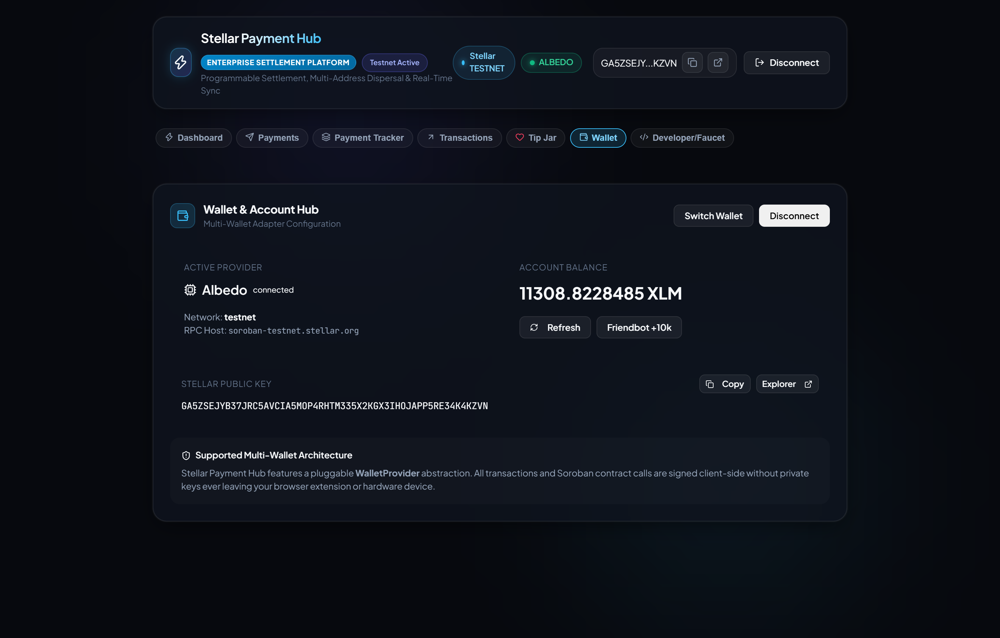
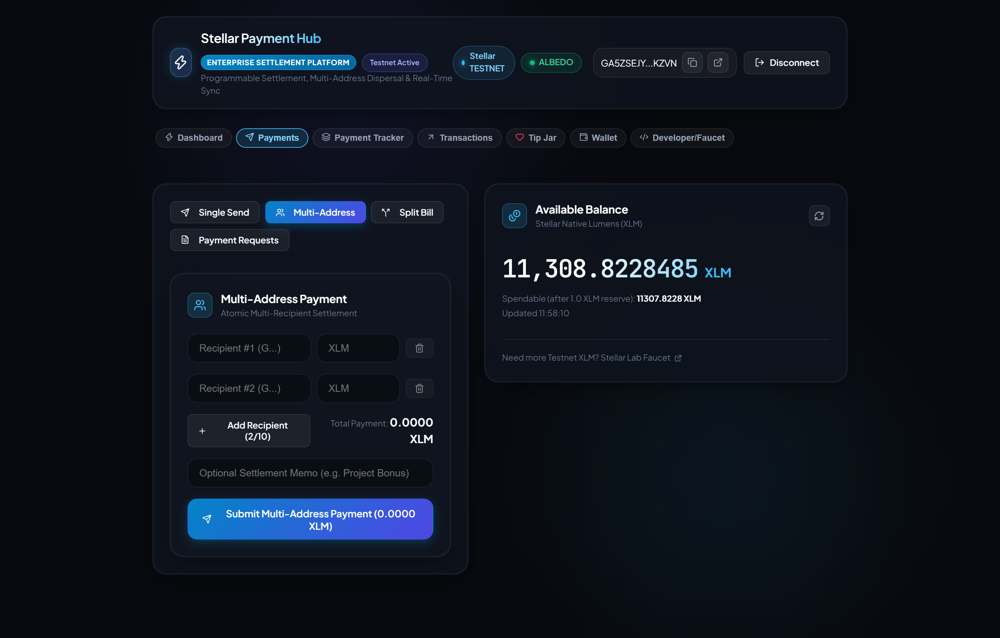
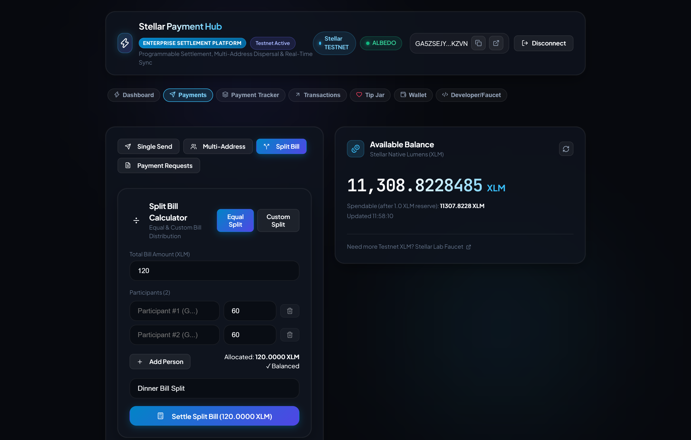
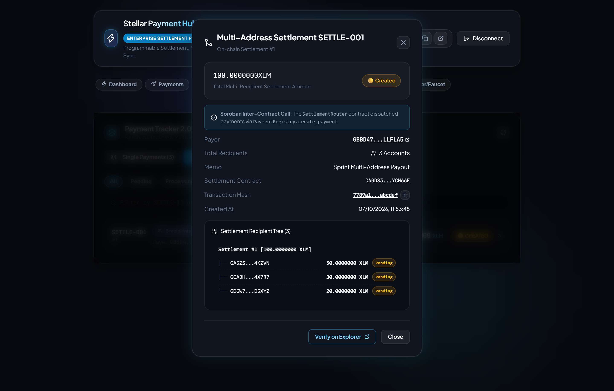
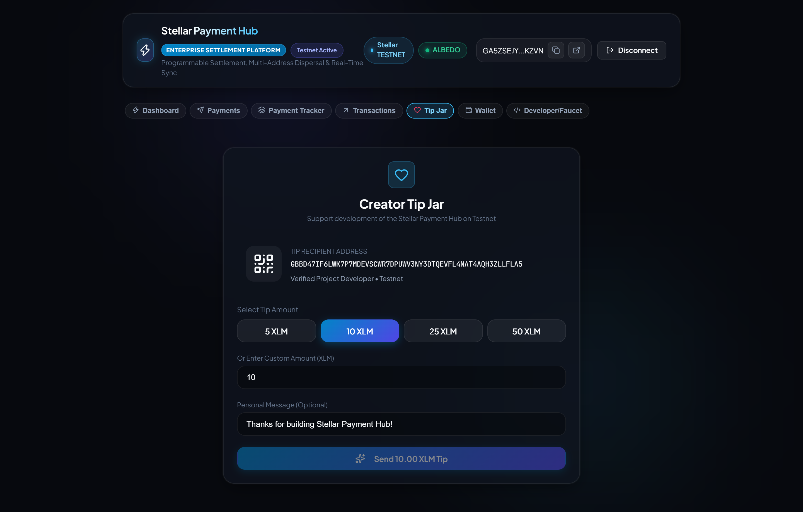
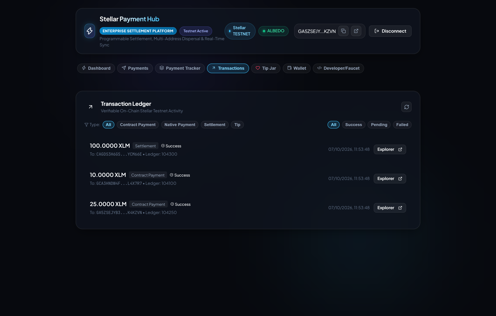

# Stellar Payment Hub — Enterprise Settlement & Payment Platform

[](https://github.com/Stellar-Payment-Hub/stellar-payment-frontend/actions/workflows/ci.yml)
[](https://stellar-payment-frontend.vercel.app)
[](https://stellar.org)
[](https://stellar.expert/explorer/testnet/contract/CD5D7OITCBFJJDHQVEZ6Y7MYIZSWEVOCQO4ES7WZEWW3S37IGUVZAI7S)
[](https://stellar.expert/explorer/testnet/contract/CAGDS3H6GSNB7FSSFFDAAO5MX3GNVCUBNKIVUI52TAK7PXUUEXYCM66E)
[](https://github.com/Stellar-Payment-Hub/stellar-payment-frontend/actions)
[](https://freighter.app)
[](https://www.typescriptlang.org/)
[](LICENSE)

**Stellar Payment Hub** is an enterprise-grade, decentralized payment application and programmable settlement platform built on the **Stellar Network** and **Soroban smart contracts**.

It delivers a unified, production-ready payment experience combining native peer-to-peer XLM transfers, atomic multi-address disbursements, remainder-safe expense splitting, shareable payment requests, a public creator tip jar, and real-time ledger synchronization.

* **Live Public Demo**: [https://stellar-payment-frontend.vercel.app](https://stellar-payment-frontend.vercel.app)
* **SettlementRouter Contract Address**: [`CAGDS3H6GSNB7FSSFFDAAO5MX3GNVCUBNKIVUI52TAK7PXUUEXYCM66E`](https://stellar.expert/explorer/testnet/contract/CAGDS3H6GSNB7FSSFFDAAO5MX3GNVCUBNKIVUI52TAK7PXUUEXYCM66E)
* **PaymentRegistry Contract Address**: [`CD5D7OITCBFJJDHQVEZ6Y7MYIZSWEVOCQO4ES7WZEWW3S37IGUVZAI7S`](https://stellar.expert/explorer/testnet/contract/CD5D7OITCBFJJDHQVEZ6Y7MYIZSWEVOCQO4ES7WZEWW3S37IGUVZAI7S)
* **Verifiable Testnet Transaction**: [`342eb1e83ad159e628bb047e741e95632717c45bb438eb7a87dbb401f0bc247f`](https://stellar.expert/explorer/testnet/tx/342eb1e83ad159e628bb047e741e95632717c45bb438eb7a87dbb401f0bc247f)

---

## 📸 Product Walkthrough & Interface Tour

Experience the core user flows and production capabilities of the Stellar Payment Hub:

### 1. Enterprise Settlement Dashboard & Telemetry
Real-time Stellar Horizon balance tracking, spendable balance calculation (with reserve protection), network telemetry, and quick-action navigation.


---

### 2. Multi-Wallet Authentication & Network Guard
Seamless non-custodial onboarding supporting Freighter, Albedo, and xBull with proactive Testnet network guard enforcement.



---

### 3. Atomic Multi-Address Settlement Builder
Batch disbursements across 2 to 10 recipient accounts in a single atomic operation with live mathematical balance verification and custom settlement memos.



---

### 4. Remainder-Safe Split Bill Engine
Precision expense sharing with automated remainder stroop allocation to eliminate rounding discrepancies, supporting equal and custom weighting.



---

### 5. Shareable Invoices & Payment Requests
Create and track cryptographically verifiable payment requests with shareable deep links, custom expiration windows, and instant counterparty fulfillment.


---

### 6. Payment Tracker 2.0 & Nested Recipient Tree
Live SSE event synchronization with on-chain settlement inspection. Shows the hierarchical recipient payment breakdown (`SETTLE-001` → `PAY-SUB-1`, `PAY-SUB-2`, `PAY-SUB-3`) and verified Soroban inter-contract call status.



---

### 7. Creator Tip Jar & Dynamic QR Portal
Public micropayment portal with preset denominations, custom tip amounts, dynamic QR code generation, and immediate Stellar Expert verification.



---

### 8. Verifiable On-Chain Transaction Ledger
Immutable historical record of native XLM payments, contract invocations, settlements, and tips with direct explorer inspection links.



---

## Core Features & Workflows

### 1. Dashboard & Quick Actions
* Real-time XLM balance retrieval directly from Stellar Horizon Testnet.
* Available spendable balance calculation (deducting base reserve and subentries).
* Built-in developer Friendbot funding utility (+10,000 Testnet XLM).
* One-click action shortcuts to Send, Multi-Pay, Split, Invoices, Tip Jar, and Tracker.

### 2. Atomic Multi-Address Payments (`MultiPaymentForm`)
* Batch disbursement to multiple recipient addresses (2 to 10 accounts).
* Dynamic recipient row addition and removal.
* Mathematical validation enforcing `sum(recipient amounts) == total amount`.
* Pre-flight protection against self-transfers, duplicate addresses, zero values, and insufficient funds.

### 3. Split Bill Calculator (`SplitBillForm`)
* **Equal Split**: Automatic division among participants with remainder stroop allocation to eliminate rounding loss.
* **Custom Split**: Individual allocation with strict mathematical balance enforcement before submission.
* Direct conversion into a settled on-chain transaction.

### 4. Shareable Invoices & Payment Requests (`PaymentRequestManager`)
* Generate shareable payment requests with unique URLs (`?tab=payments&request=REQ-001`).
* Configurable expiration windows, amount values, and reference descriptions.
* Counterparty can connect any supported wallet and execute on-chain fulfillment.

### 5. Creator Tip Jar (`TipJarView`)
* Public tipping portal with quick-tip presets (5, 10, 25, 50 XLM) and custom amounts.
* Dynamic QR code visual profile and immediate explorer link upon confirmation.

### 6. Payment Tracker 2.0 (`PaymentTracker`)
* Dual-tab category switcher: Single Registry Payments and Multi-Address Settlements (`SETTLE-xxx`).
* Status filtering: `All`, `Pending`, `Processing`, `Completed`, `Failed`, `Cancelled`.
* **Nested Settlement Tree Inspection**:
  ```text
  Settlement #1 [100.0000 XLM]
   ├── Recipient A — 50.0000 XLM [Completed] (PAY-SUB-1)
   ├── Recipient B — 30.0000 XLM [Completed] (PAY-SUB-2)
   └── Recipient C — 20.0000 XLM [Completed] (PAY-SUB-3)
  ```
* Real-time Server-Sent Events (SSE) synchronization displaying live ledger status changes without polling.

### 7. Transaction Ledger (`TransactionHistoryView`)
* Verifiable on-chain transaction feed with sequence numbers and status badges.
* Filter by transaction type: `Native Payment`, `Contract Payment`, `Settlement`, `Tip`.
* Direct links to inspect transactions on the Stellar Expert Explorer.

### 8. Modular Multi-Wallet Integration
* Connects via **Freighter**, **Albedo**, and **xBull**.
* Network validation preventing accidental Mainnet execution during Testnet operations.
* Clean disconnection and wallet switching workflows.

---

## Architectural Topology

```text
┌────────────────────────────────────────────────────────┐
│                        FRONTEND                        │
│                                                        │
│  Dashboard │ Payments │ Multi-Pay │ Split │ Tip Jar    │
│  Tracker 2.0 │ Transactions │ Faucet Developer         │
└───────────────────────────┬────────────────────────────┘
                            │
               Wallet / API / SSE Stream
                            │
        ┌───────────────────┴───────────────────┐
        ▼                                       ▼
┌──────────────┐                       ┌─────────────────┐
│ Stellar      │                       │ Backend API     │
│ Wallets      │                       │ (REST / SSE)    │
│ (Freighter,  │                       │ Event Processor │
│ Albedo,      │                       │ PostgreSQL      │
│ xBull)       │                       └────────┬────────┘
└───────┬──────┘                                │
        └───────────────────┬───────────────────┘
                            ▼
              ┌───────────────────────────┐
              │      Stellar Testnet      │
              │                           │
              │ Native XLM Transfers      │
              │ Soroban Contract Events   │
              └─────────────┬─────────────┘
                            ▼
              ┌───────────────────────────┐
              │     Soroban Contracts     │
              │                           │
              │ SettlementRouter          │
              │ PaymentRegistry           │
              └───────────────────────────┘
```

---

## User-Facing Error Handling & Validation Catalog

| Category | Error Condition | User-Facing Message | Resolution |
| :--- | :--- | :--- | :--- |
| **Wallet** | Extension not installed | *"Wallet extension not detected. Please install Freighter or use Albedo."* | Prompt user with wallet download link |
| **Wallet** | User rejects signing | *"Transaction rejected in your wallet. No funds were transferred."* | Allow user to modify parameters and retry |
| **Wallet** | Wrong network | *"Connected wallet is on Public network. Please switch to Stellar Testnet."* | Network selector prompt |
| **Payment** | Invalid Stellar address | *"Please enter a valid 56-character Stellar address starting with G."* | Enforce StrKey Ed25519 checksum validation |
| **Payment** | Self-transfer attempt | *"Recipient address cannot be your own wallet address."* | User must specify a counterparty address |
| **Payment** | Duplicate recipient | *"Duplicate recipient address detected in multi-payment batch."* | Deduplicate recipient entries |
| **Payment** | Insufficient balance | *"Insufficient XLM balance. Amount exceeds your spendable funds."* | Check spendable balance calculation |
| **Payment** | Split sum mismatch | *"Sum of participant shares must equal the total bill amount."* | Auto-balance or adjust individual shares |
| **Payment** | Memo exceeds limit | *"Memo exceeds Stellar's 28-byte UTF-8 limit."* | Truncate or condense memo text |
| **Contract** | RPC or network error | *"Blockchain transaction submission failed. Please verify RPC connection and retry."* | Check Horizon / RPC status and retry |

---

## Automated Test Coverage

The frontend maintains extensive automated test coverage across form validation, wallet connection state, settlement math, bill splitting, and live tracker rendering:

```bash
npm test
```

### Verified Test Output

```text
 ✓ tests/validation.test.ts (17 tests)
 ✓ tests/wallet.test.tsx (7 tests)
 ✓ tests/transaction-status.test.tsx (3 tests)
 ✓ tests/multi-wallet.test.tsx (3 tests)
 ✓ tests/payment-tracker.test.tsx (2 tests)
 ✓ tests/contract-read.test.tsx (2 tests)
 ✓ tests/settlements-and-splits.test.tsx (6 tests)

 Test Files  7 passed (7)
      Tests  40 passed (40)
```

---

## Performance & UX Design

* **Zero Polling Overhead**: Replaces constant HTTP polling with a persistent Server-Sent Events (SSE) connection that pushes ledger updates to the UI in real time.
* **Responsive Layouts**: Designed mobile-first with touch-friendly button targets, responsive card grids, and collapsible navigation for mobile, tablet, and desktop viewports.
* **Optimistic Local Caching**: Instant UI state transitions with background on-chain confirmation verification.
* **Theme & Typography**: Curated dark-mode palette using HSL color tokens, custom glow accents, and typography via Plus Jakarta Sans and JetBrains Mono.

---

## Local Development & Setup

```bash
# 1. Clone repository
git clone https://github.com/Stellar-Payment-Hub/stellar-payment-frontend.git
cd stellar-payment-frontend

# 2. Install dependencies
npm install

# 3. Configure environment
cp .env.example .env

# 4. Run automated test suite
npm test

# 5. Build production bundle
npm run build

# 6. Start local dev server
npm run dev
```

---

## Environment Variables

| Variable | Description | Default |
| :--- | :--- | :--- |
| `VITE_STELLAR_NETWORK` | Stellar network target | `testnet` |
| `VITE_HORIZON_URL` | Stellar Horizon RPC endpoint | `https://horizon-testnet.stellar.org` |
| `VITE_SOROBAN_RPC_URL` | Soroban RPC provider endpoint | `https://soroban-testnet.stellar.org` |
| `VITE_PAYMENT_REGISTRY_CONTRACT` | PaymentRegistry contract address | `CD5D7OITCBFJJDHQVEZ6Y7MYIZSWEVOCQO4ES7WZEWW3S37IGUVZAI7S` |
| `VITE_SETTLEMENT_CONTRACT` | SettlementRouter contract address | `CAGDS3H6GSNB7FSSFFDAAO5MX3GNVCUBNKIVUI52TAK7PXUUEXYCM66E` |
| `VITE_BACKEND_URL` | Backend API and SSE stream endpoint | `http://localhost:3001` |
